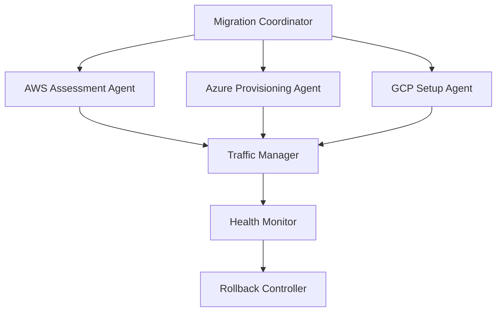

# Advanced Enterprise Usage Scenarios (51-75)

## Multi-Cloud Deployment & Migration Strategies (51-55)

### Scenario 51: Multi-Cloud Kubernetes Migration with Zero Downtime
**Architecture Pattern**: Blue-Green Multi-Cloud Deployment
**Business Context**: Fortune 500 company migrating from AWS EKS to hybrid AWS/Azure/GCP setup

**Agent Orchestration Flow**:


**Implementation Strategy**:
- **Hierarchical Swarm**: Migration Coordinator spawns cloud-specific agents
- **Consensus Protocol**: Byzantine fault tolerance for multi-cloud state management
- **Real-time Monitoring**: CRDT synchronization for distributed health checks

**Cost Optimization**:
- Spot instance arbitrage across clouds
- Regional pricing analysis with ML prediction
- Resource right-sizing based on historical usage patterns

---

### Scenario 52: Enterprise Data Lake Migration Across Cloud Providers
**Architecture Pattern**: Event-Driven Data Pipeline with CDC
**Business Context**: Financial services firm moving 50TB+ data lake from on-premises to multi-cloud

**Agent Communication Matrix**:
```
Data Assessment Agent <---> Schema Validator Agent
        |                           |
        v                           v
Migration Planner <----------> Performance Monitor
        |                           |
        v                           v
Batch Processor <------------> Quality Assurance Agent
```

**Resilience Patterns**:
- Circuit breaker for external API calls
- Exponential backoff with jitter
- Dead letter queues for failed transformations
- Checkpointing every 1GB of processed data

**Performance Optimization**:
- Parallel processing with worker pools
- Compressed data transfer with delta compression
- Edge caching for frequently accessed datasets

---

### Scenario 53: Multi-Region Disaster Recovery Orchestration
**Architecture Pattern**: Active-Active Multi-Region with Eventual Consistency
**Business Context**: E-commerce platform requiring 99.99% uptime across global regions

**Swarm Topology**: Mesh network with regional coordinators
```
Primary Region (US-East)     Secondary Region (EU-West)     Tertiary Region (APAC)
├── Load Balancer Agent      ├── Load Balancer Agent        ├── Load Balancer Agent
├── Database Sync Agent      ├── Database Sync Agent        ├── Database Sync Agent
├── Cache Manager Agent      ├── Cache Manager Agent        ├── Cache Manager Agent
└── Health Monitor Agent     └── Health Monitor Agent       └── Health Monitor Agent
```

**Fault Tolerance Mechanisms**:
- Raft consensus for configuration management
- CRDT for conflict-free data replication
- Gossip protocol for failure detection
- Automated failover with health score weighting

---

### Scenario 54: Hybrid Cloud Serverless Architecture Migration
**Architecture Pattern**: Function-as-a-Service with Event Mesh
**Business Context**: Media processing company transitioning monolith to serverless across AWS Lambda, Azure Functions, and Google Cloud Functions

**Event-Driven Architecture**:
```
API Gateway Mesh --> Event Router --> Function Dispatcher
                         |                    |
                         v                    v
                   Dead Letter Queue    Performance Tracker
                         |                    |
                         v                    v
                   Retry Handler        Cost Optimizer
```

**Agent Specialization**:
- **Function Analyzer**: Code complexity and performance prediction
- **Resource Optimizer**: Memory and timeout tuning
- **Cost Monitor**: Real-time spend analysis with budget alerts
- **Security Scanner**: Vulnerability assessment and compliance validation

---

### Scenario 55: Multi-Cloud Network Fabric with SD-WAN Integration
**Architecture Pattern**: Software-Defined Wide Area Network with Cloud Integration
**Business Context**: Global manufacturing company connecting 200+ locations through multi-cloud backbone

**Network Topology Management**:
```
Central SDN Controller
├── AWS Transit Gateway Agent
├── Azure Virtual WAN Agent
├── GCP Network Connectivity Agent
└── On-Premises Edge Agent
    ├── Bandwidth Monitor
    ├── Latency Optimizer
    ├── Security Gateway
    └── QoS Manager
```

**Optimization Algorithms**:
- Dynamic routing based on real-time latency
- Bandwidth allocation using weighted fair queuing
- Automatic failover with sub-second detection
- Cost-aware path selection with SLA guarantees

---

## Enterprise-Scale Testing & Quality Assurance (56-60)

### Scenario 56: AI-Powered End-to-End Test Generation and Execution
**Architecture Pattern**: Behavior-Driven Development with ML Test Generation
**Business Context**: Banking application requiring comprehensive regression testing across 500+ user journeys

**Test Orchestration Hierarchy**:
```
Master Test Coordinator
├── User Journey Analyzer
├── Test Case Generator (ML-powered)
├── Parallel Execution Manager
│   ├── UI Test Runner (Selenium Grid)
│   ├── API Test Runner (REST/GraphQL)
│   ├── Performance Test Runner (JMeter)
│   └── Security Test Runner (OWASP ZAP)
├── Results Aggregator
└── Failure Analysis Agent
```

**Machine Learning Integration**:
- GPT-4 powered test case generation from user stories
- Visual regression detection using computer vision
- Anomaly detection for performance baseline deviations
- Predictive test failure analysis based on code changes

**Scalability Features**:
- Kubernetes-based test execution with auto-scaling
- Distributed test data management
- Parallel test execution across multiple environments
- Real-time result streaming with WebSocket connections

---

### Scenario 57: Chaos Engineering at Enterprise Scale
**Architecture Pattern**: Controlled Failure Injection with Automated Recovery
**Business Context**: Streaming service testing resilience of microservices architecture serving 100M+ users

**Chaos Orchestration Network**:
```
Chaos Commander
├── Failure Injection Agents
│   ├── Network Partitioner
│   ├── Resource Exhaustor
│   ├── Service Terminator
│   └── Data Corruptor
├── System Observer Agents
│   ├── Metrics Collector
│   ├── Log Analyzer
│   ├── Performance Monitor
│   └── User Experience Tracker
└── Recovery Validation Agent
```

**Blast Radius Control**:
- Gradual failure escalation (1% → 10% → 50% traffic)
- Automatic rollback on SLA breach
- Canary deployment integration
- Real-time impact assessment

**Safety Mechanisms**:
- Pre-flight safety checks
- Automatic experiment termination
- Mean Time to Recovery (MTTR) optimization
- Comprehensive audit logging

---

### Scenario 58: Multi-Environment Test Data Management Pipeline
**Architecture Pattern**: Data Masking and Synthetic Data Generation
**Business Context**: Healthcare system managing PHI-compliant test data across dev/staging/prod environments

**Data Pipeline Architecture**:
```
Production Database --> Data Classification Agent --> Masking Engine
                                    |                        |
                                    v                        v
                            Synthetic Data Generator --> Test Data Distributor
                                    |                        |
                                    v                        v
                            Quality Validator --> Environment Manager
                                                            |
                                                            v
                                                    Compliance Auditor
```

**Data Governance Features**:
- Automated PII detection and classification
- Role-based access control for test data
- Data lineage tracking and auditing
- GDPR/HIPAA compliance validation

**Performance Optimizations**:
- Incremental data synchronization
- Compressed data transfer
- Parallel masking operations
- Cache-friendly data structures

---

### Scenario 59: Continuous Security Testing Integration
**Architecture Pattern**: DevSecOps with Automated Threat Modeling
**Business Context**: Financial trading platform integrating security testing into CI/CD pipeline

**Security Testing Mesh**:
```
Security Orchestrator
├── Static Analysis Agents
│   ├── Code Vulnerability Scanner
│   ├── Dependency Check Agent
│   ├── License Compliance Agent
│   └── Secret Detection Agent
├── Dynamic Analysis Agents
│   ├── Penetration Testing Agent
│   ├── Fuzzing Engine
│   ├── Container Security Scanner
│   └── Infrastructure Scanner
└── Threat Intelligence Agent
```

**Continuous Compliance**:
- Real-time vulnerability assessment
- Automated compliance reporting (SOX, PCI-DSS)
- Risk scoring with ML-based threat prediction
- Integration with SIEM systems

**Remediation Automation**:
- Automatic patch application for low-risk vulnerabilities
- Pull request generation for security fixes
- False positive learning and filtering
- Security metrics dashboard

---

### Scenario 60: Performance Testing with AI-Driven Load Modeling
**Architecture Pattern**: Adaptive Load Testing with Machine Learning
**Business Context**: E-commerce platform preparing for Black Friday traffic (10x normal load)

**Load Testing Ecosystem**:
```
AI Load Modeler
├── User Behavior Analyzer
├── Traffic Pattern Predictor
├── Load Generator Cluster
│   ├── Geographic Load Agents (US, EU, APAC)
│   ├── Device Type Simulators (Mobile, Desktop, Tablet)
│   ├── Network Condition Emulators
│   └── Browser Behavior Simulators
├── Real-time Performance Monitor
└── Capacity Planning Agent
```

**Intelligent Load Generation**:
- ML-based user journey simulation
- Dynamic load adjustment based on response times
- Realistic data generation for complex scenarios
- Multi-variate testing (A/B test impact on performance)

**Predictive Analytics**:
- Capacity planning with confidence intervals
- Bottleneck prediction before they occur
- Cost optimization for cloud resources
- SLA violation risk assessment

---

## Real-Time Monitoring & Self-Healing Systems (61-65)

### Scenario 61: Autonomous Database Performance Optimization
**Architecture Pattern**: Self-Healing Database with ML-Driven Tuning
**Business Context**: Trading platform database requiring sub-millisecond query response times

**Database Intelligence Network**:
```
Database Performance Commander
├── Query Performance Analyzer
├── Index Optimization Agent
├── Resource Allocation Manager
├── Cache Strategy Optimizer
├── Connection Pool Manager
└── Automated Tuning Agent
    ├── SQL Rewrite Engine
    ├── Execution Plan Optimizer
    ├── Statistics Updater
    └── Configuration Tuner
```

**Self-Healing Capabilities**:
- Automatic index creation/dropping based on query patterns
- Dynamic memory allocation optimization
- Query plan cache warming
- Deadlock detection and resolution

**Machine Learning Models**:
- Query performance prediction
- Workload pattern recognition
- Resource usage forecasting
- Anomaly detection for performance degradation

---

### Scenario 62: Container Orchestration with Predictive Scaling
**Architecture Pattern**: Kubernetes with AI-Driven Resource Management
**Business Context**: Video streaming service handling variable load (10x during live events)

**Kubernetes AI Orchestra**:
```
Cluster Intelligence Hub
├── Workload Predictor Agent
├── Resource Allocation Agent
├── Pod Lifecycle Manager
├── Network Traffic Analyzer
├── Cost Optimization Agent
└── Failure Prediction Agent
    ├── Node Health Monitor
    ├── Pod Restart Predictor
    ├── Resource Exhaustion Detector
    └── Performance Drift Analyzer
```

**Predictive Capabilities**:
- Traffic spike prediction (5-30 minutes ahead)
- Resource demand forecasting
- Optimal pod placement using ML
- Preemptive node scaling

**Cost Optimization**:
- Spot instance management with interruption prediction
- Right-sizing recommendations
- Multi-zone cost arbitrage
- Reserved capacity optimization

---

### Scenario 63: Application Performance Monitoring with Root Cause Analysis
**Architecture Pattern**: Distributed Tracing with AI-Powered Correlation
**Business Context**: Microservices architecture with 200+ services requiring instant issue resolution

**APM Intelligence Network**:
```
Master Diagnostician
├── Trace Collection Agents (per service)
├── Metric Correlation Engine
├── Log Analysis Agent
├── Error Pattern Detector
├── Performance Baseline Manager
└── Root Cause Analyzer
    ├── Dependency Graph Analyzer
    ├── Timing Correlation Engine
    ├── Resource Bottleneck Detector
    └── External Service Monitor
```

**Intelligent Correlation**:
- Cross-service error propagation tracking
- Performance regression detection
- Anomaly clustering and pattern matching
- Automated incident escalation

**Proactive Remediation**:
- Circuit breaker auto-configuration
- Cache warming strategies
- Database connection pool optimization
- Load balancer weight adjustment

---

### Scenario 64: Network Infrastructure Self-Optimization
**Architecture Pattern**: Software-Defined Networking with Autonomous Management
**Business Context**: Global CDN optimizing content delivery across 150+ edge locations

**Network Intelligence Fabric**:
```
Global Network Commander
├── Regional Traffic Managers
│   ├── Bandwidth Utilization Monitor
│   ├── Latency Optimization Agent
│   ├── Route Optimization Engine
│   └── Congestion Avoidance Agent
├── Content Delivery Optimizers
│   ├── Cache Hit Rate Analyzer
│   ├── Origin Shield Manager
│   ├── Prefetch Strategy Agent
│   └── Compression Optimizer
└── Security Enforcement Layer
    ├── DDoS Detection Agent
    ├── Traffic Anomaly Detector
    ├── Geo-blocking Manager
    └── SSL Certificate Manager
```

**Autonomous Optimization**:
- Real-time traffic routing based on latency/throughput
- Dynamic cache purging and warming
- Automatic scaling of edge nodes
- Predictive bandwidth provisioning

---

### Scenario 65: Business Intelligence with Real-Time Data Streaming
**Architecture Pattern**: Lambda Architecture with Stream Processing
**Business Context**: Retail analytics platform processing 10M+ events per second for real-time insights

**Real-Time Analytics Engine**:
```
Stream Processing Coordinator
├── Data Ingestion Layer
│   ├── Kafka Message Consumers
│   ├── Schema Registry Manager
│   ├── Data Quality Validator
│   └── Event Router
├── Processing Layer
│   ├── Stream Processing Agents (Flink/Spark)
│   ├── Complex Event Processor
│   ├── Machine Learning Pipeline
│   └── Aggregation Engine
└── Serving Layer
    ├── Real-time Dashboard Agent
    ├── Alert Generation Agent
    ├── API Response Cache
    └── Historical Data Merger
```

**Stream Processing Features**:
- Exactly-once processing guarantees
- Late-arriving data handling
- Watermark-based windowing
- State management and recovery

**Business Intelligence Capabilities**:
- Real-time anomaly detection in sales patterns
- Customer behavior prediction
- Inventory optimization alerts
- Personalized recommendation generation

---

## Cross-Platform Mobile Development Workflows (66-70)

### Scenario 66: Enterprise Mobile App CI/CD with Device Farm Testing
**Architecture Pattern**: Multi-Platform Build Pipeline with Automated Testing
**Business Context**: Banking mobile app supporting iOS, Android, and Progressive Web App across 50+ device configurations

**Mobile DevOps Ecosystem**:
```
Mobile Release Orchestrator
├── Build Pipeline Managers
│   ├── iOS Build Agent (Xcode Cloud)
│   ├── Android Build Agent (Firebase)
│   ├── PWA Build Agent (Webpack)
│   └── Cross-Platform Agent (React Native/Flutter)
├── Device Farm Coordinators
│   ├── iOS Device Pool Manager
│   ├── Android Device Pool Manager
│   ├── Browser Testing Coordinator
│   └── Performance Testing Agent
├── Security Testing Suite
│   ├── Mobile Security Scanner
│   ├── API Security Tester
│   ├── Data Encryption Validator
│   └── Compliance Checker
└── Distribution Managers
    ├── App Store Connect Agent
    ├── Google Play Console Agent
    ├── Enterprise MDM Distributor
    └── Beta Testing Coordinator
```

**Testing Automation**:
- Parallel testing across 100+ real devices
- Automated UI testing with visual regression
- Performance profiling on various hardware
- Network condition simulation (3G, 4G, 5G, WiFi)

**Security & Compliance**:
- OWASP Mobile Top 10 automated scanning
- Financial compliance validation (PCI-DSS)
- Biometric authentication testing
- Certificate pinning validation

---

### Scenario 67: Cross-Platform State Management and Offline Synchronization
**Architecture Pattern**: Event Sourcing with Conflict-Free Replicated Data Types
**Business Context**: Field service mobile app requiring offline functionality and multi-device synchronization

**Offline-First Architecture**:
```
Synchronization Master
├── Device State Managers
│   ├── iOS State Manager (CoreData + CRDT)
│   ├── Android State Manager (Room + CRDT)
│   ├── Web State Manager (IndexedDB + CRDT)
│   └── Backend Sync Controller
├── Conflict Resolution Agents
│   ├── Last-Writer-Wins Resolver
│   ├── Operational Transform Engine
│   ├── Business Logic Validator
│   └── Merge Conflict Detector
├── Data Validation Layer
│   ├── Schema Version Manager
│   ├── Data Integrity Checker
│   ├── Business Rule Validator
│   └── Audit Trail Generator
└── Network Resilience Layer
    ├── Connection Monitor
    ├── Retry Policy Manager
    ├── Bandwidth Optimizer
    └── Progressive Sync Controller
```

**Synchronization Features**:
- Eventual consistency with conflict resolution
- Delta synchronization for bandwidth efficiency
- Priority-based sync ordering
- Comprehensive audit logging

**Performance Optimization**:
- Background synchronization
- Compression of sync payloads
- Incremental data loading
- Smart prefetching based on usage patterns

---

### Scenario 68: Mobile App Performance Monitoring and Crash Analytics
**Architecture Pattern**: Real-Time Mobile Telemetry with ML-Powered Insights
**Business Context**: Social media app with 50M+ monthly active users requiring comprehensive performance monitoring

**Mobile Observability Platform**:
```
Mobile Analytics Command Center
├── Telemetry Collection Agents
│   ├── iOS Telemetry Agent (Swift/Objective-C)
│   ├── Android Telemetry Agent (Kotlin/Java)
│   ├── React Native Bridge Agent
│   └── Flutter Plugin Agent
├── Real-Time Processing Layer
│   ├── Crash Report Analyzer
│   ├── Performance Metrics Processor
│   ├── User Session Tracker
│   └── Feature Usage Monitor
├── Machine Learning Pipeline
│   ├── Crash Prediction Model
│   ├── Performance Regression Detector
│   ├── User Churn Predictor
│   └── A/B Test Impact Analyzer
└── Alerting and Response System
    ├── Critical Issue Detector
    ├── Stakeholder Notification Agent
    ├── Auto-Rollback Trigger
    └── Performance Dashboard Generator
```

**Advanced Analytics**:
- Real-time crash symbolication and grouping
- Performance impact correlation with user engagement
- Battery usage optimization recommendations
- Memory leak detection and prevention

---

### Scenario 69: Enterprise Mobile Device Management Integration
**Architecture Pattern**: Zero-Trust Mobile Security with Policy Enforcement
**Business Context**: Healthcare organization managing 10,000+ mobile devices with HIPAA compliance requirements

**Mobile Security Orchestrator**:
```
Enterprise Mobility Commander
├── Device Management Agents
│   ├── iOS MDM Agent (Apple Business Manager)
│   ├── Android EMM Agent (Android Enterprise)
│   ├── Windows Mobile Agent (Intune)
│   └── Bring-Your-Own-Device Manager
├── Security Policy Enforcers
│   ├── App Wrapping Agent
│   ├── Data Loss Prevention Agent
│   ├── VPN Configuration Manager
│   └── Certificate Management Agent
├── Compliance Monitoring System
│   ├── Device Compliance Scanner
│   ├── App Inventory Auditor
│   ├── Data Classification Agent
│   └── Violation Response Handler
└── User Experience Optimizers
    ├── Single Sign-On Coordinator
    ├── Conditional Access Manager
    ├── Performance Monitor
    └── Help Desk Integration Agent
```

**Security Features**:
- Zero-trust device verification
- Real-time policy enforcement
- Automated threat response
- Comprehensive audit trails

**Compliance Automation**:
- HIPAA violation detection and reporting
- SOX compliance monitoring
- GDPR data handling validation
- Regulatory change impact analysis

---

### Scenario 70: Progressive Web App with Native Integration
**Architecture Pattern**: Hybrid Architecture with Native Shell
**Business Context**: E-commerce platform delivering native-like experience across all platforms while maintaining single codebase

**Hybrid Development Pipeline**:
```
PWA Enhancement Orchestrator
├── Core Web App Builders
│   ├── Service Worker Manager
│   ├── Web App Manifest Generator
│   ├── Push Notification Handler
│   └── Offline Storage Manager
├── Native Integration Layers
│   ├── iOS Wrapper (WKWebView + Swift)
│   ├── Android Wrapper (WebView + Kotlin)
│   ├── Desktop Wrapper (Electron/Tauri)
│   └── Native Feature Bridges
├── Performance Optimizers
│   ├── Critical Resource Prioritizer
│   ├── Code Splitting Manager
│   ├── Image Optimization Agent
│   └── Caching Strategy Controller
└── Distribution Coordinators
    ├── Web Deployment Agent
    ├── App Store Publisher
    ├── Play Store Publisher
    └── Progressive Enhancement Monitor
```

**Native Feature Integration**:
- Camera and photo access
- Biometric authentication
- Push notifications
- Background synchronization
- Native navigation patterns

**Performance Features**:
- App shell architecture
- Service worker caching strategies
- Critical resource preloading
- Lazy loading with intersection observer

---

## Blockchain & Cryptocurrency Integrations (71-75)

### Scenario 71: Multi-Chain DeFi Protocol Integration Platform
**Architecture Pattern**: Cross-Chain Bridge with Automated Market Making
**Business Context**: Financial services company building institutional DeFi trading platform supporting Ethereum, Polygon, Avalanche, and Solana

**DeFi Integration Architecture**:
```
Cross-Chain Protocol Commander
├── Blockchain Connector Agents
│   ├── Ethereum RPC Manager (Web3.py)
│   ├── Polygon Integration Agent
│   ├── Avalanche C-Chain Connector
│   ├── Solana JSON-RPC Agent
│   └── Layer 2 Bridge Coordinators
├── Smart Contract Orchestrators
│   ├── Contract Deployment Agent
│   ├── Transaction Pool Manager
│   ├── Gas Optimization Engine
│   └── Contract Interaction Router
├── DeFi Protocol Integrations
│   ├── Uniswap V3 Liquidity Manager
│   ├── Compound Lending Agent
│   ├── Aave Flash Loan Coordinator
│   ├── Curve Stable Swap Agent
│   └── Balancer Pool Manager
└── Risk Management System
    ├── Impermanent Loss Calculator
    ├── Slippage Protection Agent
    ├── MEV Protection Layer
    └── Regulatory Compliance Monitor
```

**Cross-Chain Features**:
- Atomic cross-chain swaps
- Liquidity optimization across chains
- Arbitrage opportunity detection
- Yield farming strategy automation

**Risk Management**:
- Real-time TVL monitoring
- Smart contract audit integration
- Rug pull detection algorithms
- Regulatory compliance automation

---

### Scenario 72: Enterprise Blockchain Supply Chain Tracking
**Architecture Pattern**: Permissioned Blockchain with IoT Integration
**Business Context**: Global pharmaceutical company tracking drug authenticity from manufacturer to patient

**Blockchain Supply Chain Network**:
```
Supply Chain Transparency Hub
├── Blockchain Infrastructure
│   ├── Hyperledger Fabric Manager
│   ├── Consensus Node Coordinators
│   ├── Certificate Authority Agents
│   └── Channel Management System
├── IoT Integration Layer
│   ├── RFID Tag Readers
│   ├── Temperature Sensor Monitors
│   ├── GPS Location Trackers
│   └── Tamper Evidence Detectors
├── Smart Contract Executors
│   ├── Transfer Authorization Agent
│   ├── Quality Assurance Validator
│   ├── Compliance Checker
│   └── Audit Trail Generator
└── External System Integrators
    ├── ERP System Connector
    ├── Regulatory Reporting Agent
    ├── Customer Portal Interface
    └── Anti-Counterfeiting System
```

**Traceability Features**:
- End-to-end product journey tracking
- Real-time authenticity verification
- Automated compliance reporting
- Counterfeit detection algorithms

**Integration Capabilities**:
- SAP/Oracle ERP synchronization
- FDA reporting automation
- Customer authentication portal
- Recall management system

---

### Scenario 73: Central Bank Digital Currency (CBDC) Infrastructure
**Architecture Pattern**: Hybrid Blockchain with Privacy Preservation
**Business Context**: Central bank developing digital currency infrastructure for nationwide deployment

**CBDC Platform Architecture**:
```
Digital Currency Infrastructure Commander
├── Core Blockchain Services
│   ├── Consensus Mechanism Manager (Proof-of-Authority)
│   ├── Transaction Validation Agents
│   ├── Double-Spend Prevention System
│   └── Network Partition Handler
├── Privacy Preservation Layer
│   ├── Zero-Knowledge Proof Generator
│   ├── Ring Signature Processor
│   ├── Mixing Protocol Coordinator
│   └── Selective Disclosure Manager
├── Monetary Policy Enforcement
│   ├── Interest Rate Adjuster
│   ├── Money Supply Controller
│   ├── Transaction Limit Enforcer
│   └── Anti-Money Laundering Agent
├── Financial Institution Interfaces
│   ├── Commercial Bank Connectors
│   ├── Payment Processor Integrations
│   ├── ATM Network Interface
│   └── Mobile Wallet SDK Manager
└── Regulatory Compliance System
    ├── Transaction Monitoring Agent
    ├── Suspicious Activity Reporter
    ├── KYC/AML Validator
    └── Cross-Border Transfer Monitor
```

**Advanced Features**:
- Programmable monetary policy
- Real-time economic data integration
- Privacy-preserving analytics
- Quantum-resistant cryptography

**Scalability Solutions**:
- Sharding for high throughput
- Layer 2 payment channels
- Optimistic rollup integration
- State channel networks

---

### Scenario 74: NFT Marketplace with Fractional Ownership Platform
**Architecture Pattern**: Multi-Chain NFT Infrastructure with DeFi Integration
**Business Context**: Art investment platform enabling fractional ownership of high-value artworks through NFTs

**NFT Fractionalization Platform**:
```
Digital Asset Fractionalization Hub
├── Multi-Chain NFT Managers
│   ├── Ethereum ERC-721/1155 Handler
│   ├── Polygon NFT Bridge
│   ├── Solana Metaplex Integration
│   └── Flow Blockchain Connector
├── Fractionalization Engine
│   ├── ERC-20 Token Generator
│   ├── Ownership Share Calculator
│   ├── Voting Rights Manager
│   └── Revenue Distribution Agent
├── Marketplace Infrastructure
│   ├── Auction Mechanism Controller
│   ├── Price Discovery Engine
│   ├── Liquidity Pool Manager
│   └── Trading Bot Detector
├── Authentication & Provenance
│   ├── Digital Signature Validator
│   ├── Artwork Authentication Agent
│   ├── Provenance Chain Tracker
│   └── Copyright Verification System
└── DeFi Integration Layer
    ├── Collateralized Lending Agent
    ├── Yield Farming Coordinator
    ├── Insurance Protocol Interface
    └── Derivatives Market Maker
```

**Fractionalization Features**:
- Dynamic pricing based on demand
- Automated dividend distribution
- Governance token functionality
- Exit strategy mechanisms

**Market Making**:
- AMM integration for fractional tokens
- Cross-platform arbitrage detection
- Liquidity mining programs
- Price oracle integration

---

### Scenario 75: Cryptocurrency Treasury Management for Enterprises
**Architecture Pattern**: Multi-Signature Wallet with DeFi Yield Optimization
**Business Context**: Public company managing $500M+ crypto treasury with institutional-grade security and yield generation

**Enterprise Crypto Treasury Platform**:
```
Treasury Management Command Center
├── Multi-Signature Infrastructure
│   ├── Hardware Security Module Integration
│   ├── Multi-Party Computation Agents
│   ├── Threshold Signature Coordinators
│   └── Key Recovery System
├── Portfolio Management System
│   ├── Asset Allocation Optimizer
│   ├── Risk Assessment Engine
│   ├── Rebalancing Automation Agent
│   └── Performance Attribution Analyzer
├── DeFi Yield Strategies
│   ├── Lending Protocol Optimizer
│   ├── Staking Rewards Manager
│   ├── Liquidity Mining Coordinator
│   └── Yield Farming Strategy Executor
├── Compliance & Reporting
│   ├── Tax Calculation Engine
│   ├── Regulatory Reporting Agent
│   ├── Audit Trail Generator
│   └── Accounting Integration System
├── Risk Management Layer
│   ├── Value-at-Risk Calculator
│   ├── Counterparty Risk Assessor
│   ├── Smart Contract Auditor
│   └── Market Risk Monitor
└── Institutional Interfaces
    ├── Prime Brokerage Connectors
    ├── Custodial Service Integrations
    ├── OTC Trading Desk Interface
    └── Institutional Exchange APIs
```

**Security Features**:
- Air-gapped transaction signing
- Biometric authentication integration
- Anomaly detection for unusual transactions
- Incident response automation

**Yield Optimization**:
- Dynamic strategy allocation based on market conditions
- Gas fee optimization across chains
- Impermanent loss protection strategies
- Automated tax-loss harvesting

**Compliance Automation**:
- Real-time regulatory monitoring
- Automated GAAP/IFRS reporting
- Cross-border transaction compliance
- Beneficial ownership reporting

---

## Agent Orchestration Patterns Summary

### Communication Protocols Used:
1. **Hierarchical Command**: Master-slave patterns for coordinated operations
2. **Mesh Networks**: Peer-to-peer communication for resilient systems
3. **Event-Driven**: Asynchronous messaging for scalable architectures
4. **Consensus-Based**: Byzantine fault tolerance for critical decisions
5. **CRDT Synchronization**: Conflict-free replication for distributed state

### Performance Optimizations:
1. **Parallel Execution**: Concurrent agent operations
2. **Caching Strategies**: Multi-level caching across agents
3. **Load Balancing**: Intelligent workload distribution
4. **Resource Pooling**: Shared resources across agent clusters
5. **Predictive Scaling**: ML-based capacity planning

### Fault Tolerance Mechanisms:
1. **Circuit Breakers**: Automatic failure isolation
2. **Retry Policies**: Exponential backoff with jitter
3. **Health Checks**: Continuous system monitoring
4. **Graceful Degradation**: Partial functionality preservation
5. **Self-Healing**: Automated recovery procedures

These scenarios demonstrate enterprise-grade architectures with sophisticated agent orchestration patterns, emphasizing scalability, reliability, and cost optimization while maintaining high security and compliance standards.